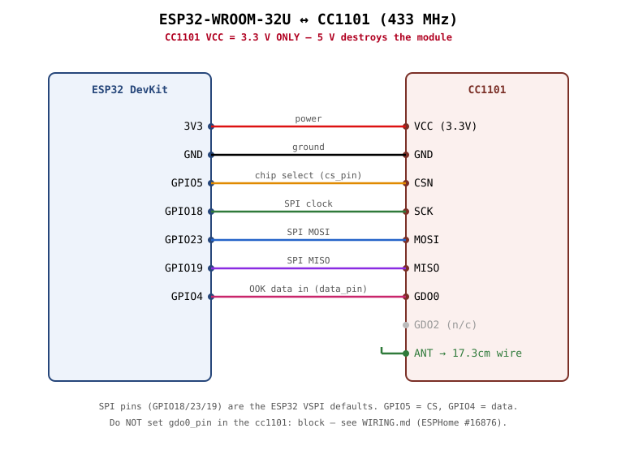

# Wiring — ESP32 (WROOM-32U) ↔ CC1101

**Power the CC1101 from 3.3 V only. 5 V will permanently damage it.**

| CC1101 pin | ESP32 pin | Wire / function | Notes |
| :--- | :--- | :--- | :--- |
| VCC | 3.3 V | Power | 3.3 V ONLY |
| GND | GND | Ground | Common ground |
| CSN / CS | GPIO5 | SPI chip select | `cs_pin` in YAML |
| SCK / CLK | GPIO18 | SPI clock | ESP32 VSPI default |
| MOSI | GPIO23 | SPI MOSI | ESP32 VSPI default |
| MISO | GPIO19 | SPI MISO | ESP32 VSPI default |
| GDO0 | GPIO4 | OOK data in | `data_pin` in YAML — driven by RMT |
| GDO2 | — | (unconnected) | not needed for TX-only |

`GPIO4` is just a convenient free pin — any usable output GPIO works, as long as
the YAML `data_pin` matches. Avoid ESP32 strapping/input-only pins.

## The GDO0 gotcha (ESPHome issue #16876)

Do **not** set `gdo0_pin:` inside the `cc1101:` block for a transmit setup. If you
do, the component calls `pin_mode()` on that pin during `begin_tx()`, which tears
down the RMT→pad routing — the chip enters TX but radiates nothing. Leaving
`gdo0_pin` unset lets `remote_transmitter` own the pin; `cc1101.begin_tx` then
only changes the radio state. (This is why the provided config omits it.)

## Antenna

Attach a 433 MHz antenna to the CC1101 module's antenna pad/pin. A straight
**~17.3 cm** wire (quarter-wave for 433.92 MHz) works well. A bare module with no
antenna radiates very weakly — enough for a nearby SDR to hear, but often not
enough to reach the target device reliably. If range is marginal, a proper
antenna helps more than bumping `output_power`.

## Board notes

- Verified on a HiLetgo **ESP32-WROOM-32U DevKit v4**. The `-U` suffix means the
  module uses a U.FL/IPEX connector for an external Wi-Fi antenna instead of the
  PCB trace antenna — that concerns the ESP32's own Wi-Fi only and has **no
  bearing on the CC1101 RF path**, so a plain WROOM-32 board works identically
  here.
- `board: esp32dev` in the YAML is correct for both variants.
- `esp-idf` framework is recommended for the CC1101 OOK RMT path (`type: esp-idf`
  in the YAML).
